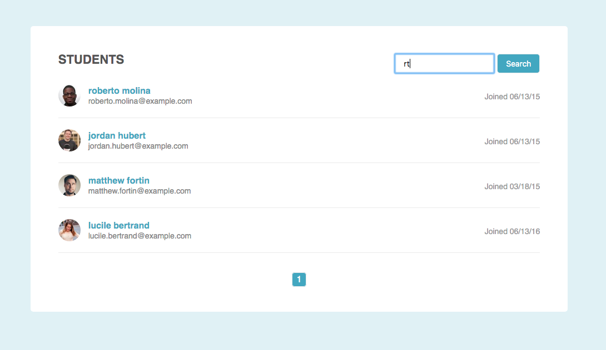
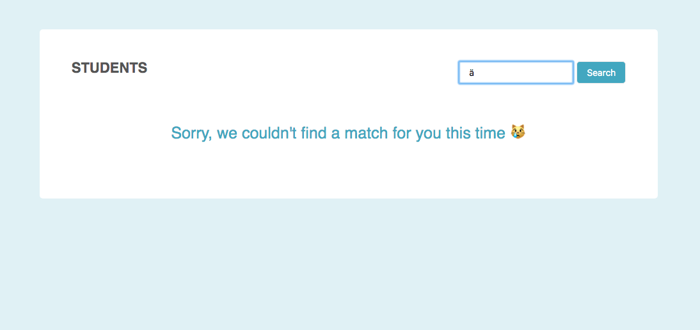

# List Pagination and Filtering

> Web page list pagination, filtering & search with "vanilla" JavaScript

## Features

* Includes searchbar to filter items from list
* Displays clickable navigation links, showing max 10 items at a time
* Flexible design, works with lists of diffierent lengths
* Displays a message if no matches are found

## Technologies

* JavaScript
* CSS
* HTML

## Demo

Active demo: <a href="https://annes99.github.io/List-Pagination-and-Filtering" target="_blank">List Pagination and Filtering</a>

## Screenshot

## Status

Project is: _completed_

## Inspiration

Treehouse Techdegree: FSJS project 2 - List Filter and Pagination

## Contact

Created by [@Annes](https://twitter.com/annesCode)
